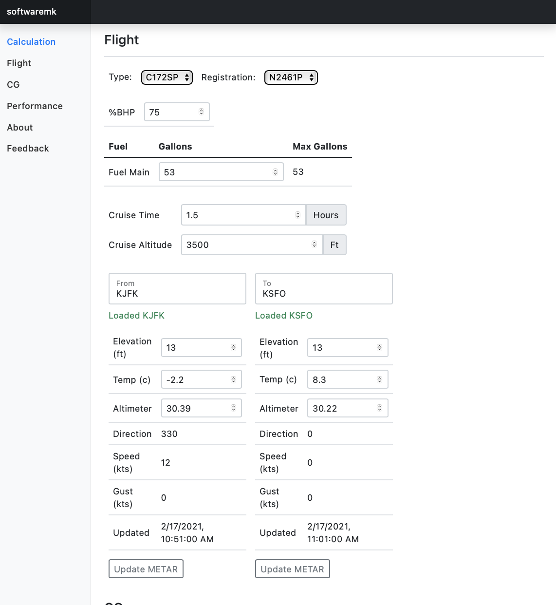
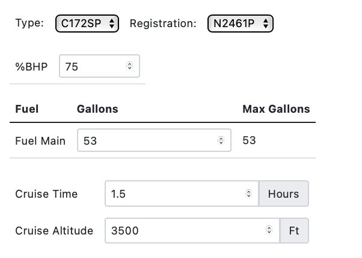
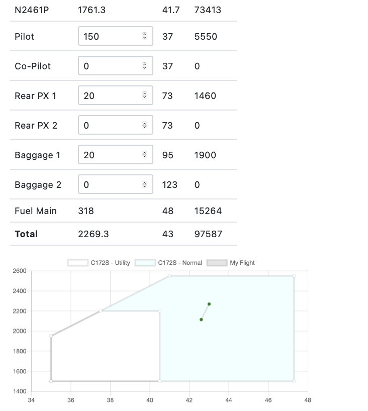

[][license-url]

### myflightperf

A simple general aviation performance calculator for a Cessna C172SP and Piper PA-30 Twin Comanche

View the [demo](http://myflightperf.azurewebsites.net). On idle timeout, this server may take several seconds to re-initialize. Please be patient.

{width=500 height=500}

### Built with

* [Apollo GraphQL](https://www.apollographql.com)
* [Express](https://expressjs.com)
* [React](https://reactjs.org)
* [NodeJS](https://nodejs.org)
* [ChartJS](https://www.chartjs.org)
* [Bootstrap](https://getbootstrap.com)

## Getting Started

To get a local copy up and running follow these simple steps.

1. Clone the repo
   ```
   git clone https://bitbucket.org/softwaremk/myflight
   ```
2. Install NPM packages
   ```
   npm i
   ```

3. Get a free API Key at [AVWX](https://avwx.rest)


4. Set key in your environment
   ```
   export avwx_key=key
   ```
5. Start dev watch mode: typescript compile client and server files, and run tests
   ```
   npm run start:dev
   ```
6. Start server:
   ```
   npm run start:server
   ```
7. Start client via webpack dev-server - requests are proxied to server in [6]
   ```
   npm run start:client
   ```
8. Run app
   ```
   http://localhost:8080
   ```

## Usage

1. Select the type (C172SP or PA30) and registration (for CG moment information), cruise time, fuel available, desired power setting, and cruise altitude

{width=300 height=200}

2. Enter a ICAO ID in FROM and TO section (e.g. - KJFK or KSFO) to download the current METAR (otherwise zero wind, standard temperature/pressure will be used for performance calculations)

3. Enter weight information for flight

4. Review CG calc for flight and performance numbers

{width=300 height=300}

## License

Distributed under the MIT License. See [`LICENSE`][license-url] for more information.

### Feedback

[twitter](https://twitter.com/softwaremk_nyc)

[emsg](softwaremk@outlook.com)

[repo](https://bitbucket.org/softwaremk/myflight)

### Acknowledgements

* [AVWX](https://avwx.rest)

[license-shield]: https://img.shields.io/bitbucket/license/softwaremk/myflightperf.svg?style=for-the-badge
[license-url]: https://bitbucket.org/softwaremk/myflight/src/master/license.txt
